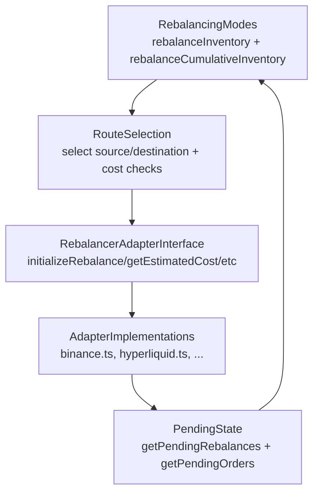

# Rebalancer Mode-Adapter Architecture

## When to read this

Read this before changing rebalancer architecture or adding a new adapter implementation. This document explains the intended separation between rebalancing modes and venue adapters.

Related docs:

- `src/rebalancer/README.md`
- `docs/inventory-vs-rebalancer-responsibilities.md`

Primary files:

- `src/rebalancer/rebalancer.ts`
- `src/rebalancer/RebalancerClientHelper.ts`
- `src/rebalancer/adapters/*`

## Core architectural boundary

The rebalancer is split into two modules with a strict interface boundary:

- **Mode logic in `rebalancer.ts`** chooses *what* should be rebalanced:
  - identify deficits and excesses,
  - prioritize which deficits to fill first,
  - evaluate eligible routes and costs,
  - enforce global guardrails (max fee percentage, pending-order limits).
- **Adapter logic in `adapters/*`** chooses *how* to execute a chosen route:
  - venue-specific initiation steps,
  - lifecycle progression for in-flight swaps,
  - pending state tracking/reporting.

As long as adapters satisfy `RebalancerAdapter`, mode implementations can stay unchanged.

## Data flow (current behavior)

## Integration points and invariants

### `RebalancerAdapter` interface invariants

Each adapter must provide:

- `getEstimatedCost` for route comparison and fee guardrails,
- `initializeRebalance` to execute selected actions,
- `getPendingOrders` so modes can cap concurrent in-flight work,
- `getPendingRebalances` so virtual balances account for in-flight state,
- lifecycle hooks (`updateRebalanceStatuses`, `sweepIntermediateBalances`).

If these are incomplete, mode behavior can degrade even if mode code is untouched.

### Route registration invariants

`RebalancerClientHelper.ts` binds adapter names to implementations and defines `RebalanceRoute` entries. A new adapter is not reachable unless:

1. it is added to the adapter map,
2. its name appears in one or more routes,
3. it survives route filtering at runtime.

### Mode-layer invariants

Mode code in `rebalancer.ts` should remain venue-agnostic:

- no adapter-specific branching in deficit/excess logic,
- no venue-specific cost or state assumptions beyond interface methods,
- route and adapter selection done through `RebalanceRoute` + adapter map lookups.

## Adding a new adapter without changing modes

Typical contributor workflow:

1. Create a new adapter in `src/rebalancer/adapters/` implementing `RebalancerAdapter`.
2. Register it in `src/rebalancer/RebalancerClientHelper.ts`.
3. Add routes referencing the adapter.
4. Ensure `getEstimatedCost`, `getPendingOrders`, and `getPendingRebalances` are production-ready.
5. Validate that both mode entrypoints can call through interface methods without code changes:
   - `rebalanceInventory`
   - `rebalanceCumulativeInventory`

## When mode changes are actually required

Touch mode logic only if portfolio policy changes, such as:

- new deficit/excess ranking semantics,
- new cross-token/cross-chain objective functions,
- new global guardrails that apply to all adapters.

Do not change mode code merely to support venue-specific execution details.

## Contributor recommendations

- Keep adapter concerns inside adapter files and base adapter utilities.
- Treat `RebalancerAdapter` as a compatibility contract.
- Prefer route/config updates and helper wiring before proposing mode edits.
- Document any intentional boundary break with rationale and tests.
