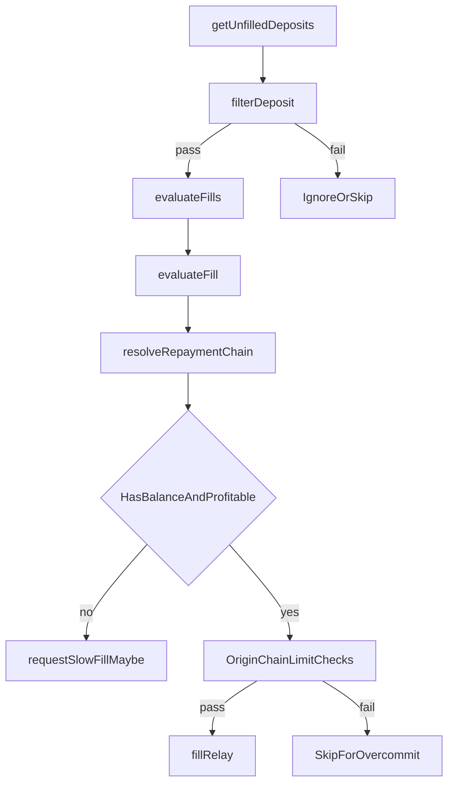

# Relayer Fill Decision Flow

## When to read this

Read this when you need to understand why a deposit is filled, ignored, slow-filled, or skipped as unprofitable.

Related overviews:

- `src/relayer/README.md`
- `src/clients/README.md`

Primary files:

- `src/relayer/Relayer.ts`
- `src/clients/InventoryClient.ts`
- `src/utils/FillUtils.ts`

## End-to-end flow

## Phase 1: `filterDeposit()`

`filterDeposit()` eliminates deposits that cannot or should not be processed by this relayer instance.

Major gates:

- config/version compatibility
- exclusivity window rules
- output token validity (`sdkUtils.invalidOutputToken`)
- route enablement (origin/destination chain allowlists)
- address validity for chain type
- blocklists and token support constraints
- input/output token compatibility via `inventoryClient.validateOutputToken()`
- minimum confirmations per value bucket
- future quote-timestamp guard
- API fill-limit checks (except forced-origin deposits)

Important behavior: many failures are marked in `ignoredDeposits` to avoid repeated reevaluation churn.

## Phase 2: `evaluateFill()`

For each filtered deposit:

1. skip when destination queue already has pending txns
2. enforce dynamic confirmation-age threshold
3. optionally force slow-fill request for configured slow depositors
4. apply minimum fill age per destination chain (if configured)
5. resolve repayment-chain + profitability data (`resolveRepaymentChain`)
6. check local output-token balance availability
7. if unprofitable or insufficient balance:
   - capture shortfall/unprofitability telemetry
   - optionally request slow fill when enabled and valid
   - return
8. if profitable and funded:
   - apply origin-chain commitment limits
   - decrement local destination balance virtually
   - enqueue `fillRelay`

## Repayment decision coupling

`evaluateFill()` relies on:

- `batchComputeLpFees()` (earlier in runtime)
- `resolveRepaymentChain()`
- `InventoryClient.determineRefundChainId()`

So apparent fill/no-fill outcomes often depend on repayment-chain eligibility, not only token balance or gross spread.

## Slow-fill path

`canSlowFill(deposit)` requires:

- input/output token equivalence
- neither origin nor destination is lite-chain constrained

`requestSlowFill()` adds additional suppressors:

- disallow if protocol forces origin repayment or destination is lite
- disallow if original deposit message is non-empty
- enforce minimum age (`RELAYER_SLOW_FILL_MIN_AGE`)
- avoid duplicate slow-fill requests

When accepted, relayer enqueues `requestSlowFill` tx (EVM or SVM path) and marks local fill status as `RequestedSlowFill`.

## Fill execution path

`fillRelay()`:

- enforces forced-origin repayment at submit time
- emits EVM/SVM fill call with chosen repayment chain and relayer address on repayment chain
- updates local fill status to `Filled`

This method is the final execution guard against upstream chain-selection mistakes.

### In-protocol swaps (unequivalent tokens): repayment behavior

Terms in this section:

- **In-protocol swap**: deposit where input and output tokens are unequivalent.
- **Equivalent-token deposit**: deposit where input and output tokens are equivalent.

For in-protocol swaps, relayer first applies token-compatibility gating via `validateOutputToken()` in `filterDeposit()`.

- If the swap is unsupported by current compatibility/swap configuration, the deposit is filtered out before any repayment-chain selection.
- If the swap is a supported swap flow, repayment handling proceeds through the same downstream pipeline as equivalent-token deposits:
  1) eligibility via `determineRefundChainId()`
  2) selection via `resolveRepaymentChain()`
  3) final submit-time guardrails in `fillRelay()`

For deeper details on stages (2) and (3), see `docs/repayment-eligibility.md` and `docs/repayment-selection.md`.

## Edge outcomes and their meaning

- skipped at filter: structurally unsupported or policy-disabled
- skipped in evaluate due to overcommit: profitability exists but origin risk budget exhausted
- unprofitable capture: candidate chains found but none clear net economics
- token shortfall capture: profitable opportunity blocked by local inventory deficit
- slow-fill requested: relayer intentionally defers fast fill and asks protocol slow path to cover liveness

## Cross-module interactions

- `TokenClient`: balance and shortfall accounting
- `ProfitClient`: net profitability and gas-aware fee math
- `InventoryClient`: repayment-chain eligibility and inventory policy
- `SpokePoolClient`: unfilled deposits, slow-fill request state, chain timing data
- `Dataworker` + `BundleDataClient`: eventual slow-fill and refund settlement in root bundles

## Contributor recommendations

- Keep `filterDeposit()` conservative; avoid pushing invalid inputs deeper into pipeline.
- If you add a new fill suppression rule, decide whether it should mark deposit as ignored or be retried later.
- Preserve `fillRelay()` guardrails even if upstream logic appears exhaustive.
- Add debug logs that explicitly classify outcome type (ignored, deferred, unprofitable, overcommitted, shortfall).
