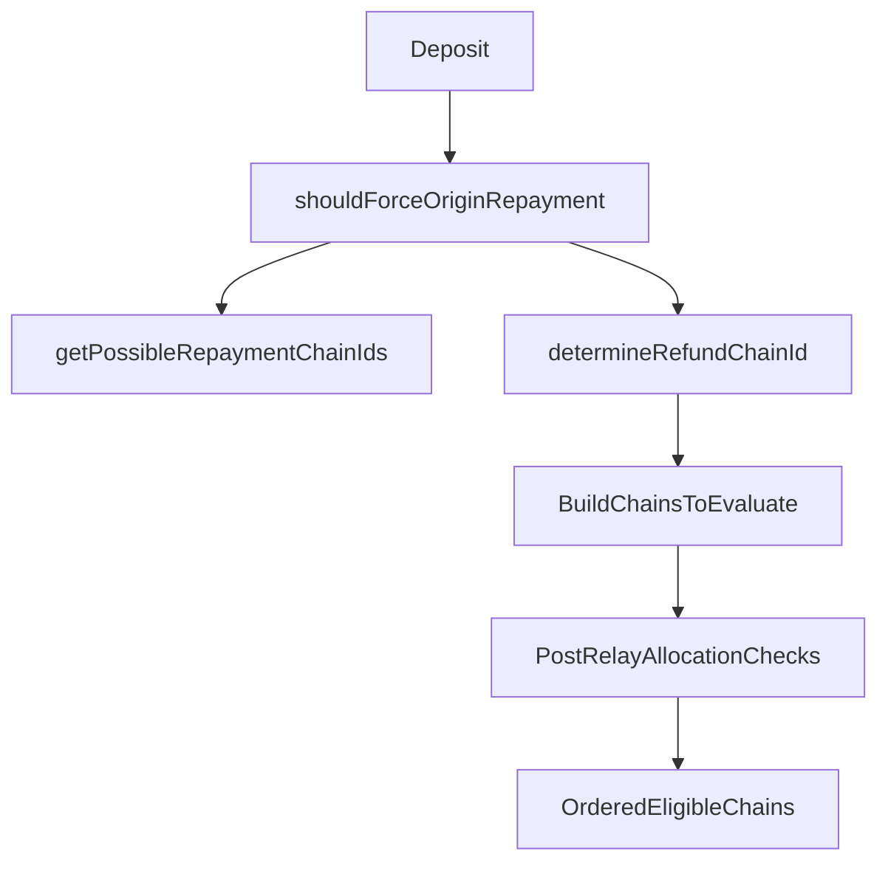

# Repayment Eligibility

## When to read this

Read this when you need to understand which repayment chains are eligible for a deposit before relayer profitability selection is applied.

Related docs:

- `docs/repayment-selection.md` (final relayer chain selection)
- `docs/inventory-virtual-balance-model.md` (virtual balance and allocation math)
- `src/clients/README.md`

Primary code:

- `src/clients/InventoryClient.ts`
- `src/utils/FillUtils.ts`

## Scope of this doc

This doc covers the InventoryClient-owned stage:

- `shouldForceOriginRepayment()`
- `getPossibleRepaymentChainIds()`
- `determineRefundChainId()`

It does not fully cover relayer profitability/fallback selection. See `docs/repayment-selection.md` for that stage.

## Key outputs and terms

- `possible repayment chains`: broad set used to precompute LP fees.
- `eligible refund chains`: ordered set from `determineRefundChainId()`.
- `preferred chains`: same ordered eligible list, consumed by `Relayer.resolveRepaymentChain()`.

## Eligibility pipeline

## Policy and force-origin logic

`shouldForceOriginRepayment()` combines:

1. protocol force (`depositForcesOriginChainRepayment()`)
2. per-chain config override (`forceOriginRepaymentPerChain[originChainId]`)
3. global config override (`forceOriginRepayment`)

with per-chain override taking priority over global override, and final result as protocol OR config force.

If force-origin is active, `getPossibleRepaymentChainIds()` short-circuits to `[originChainId]`.

## `getPossibleRepaymentChainIds()` role

This is an LP-fee precomputation helper, not final selection. It may include:

- origin chain (always)
- destination chain (if allowed)
- slow-withdrawal chains (inventory-enabled path)
- config override chain
- hub chain

When force-origin is active, it returns only origin.

## `determineRefundChainId()` role

This returns the ordered eligible chain list used by relayer chain selection.

In code order:

1. reject invalid output token (`[]`)
2. if inventory management disabled: choose destination when possible, else origin
3. enforce output-token assumptions via `validateOutputToken()`
4. compute `forceOriginRepayment`
5. if forced origin and quickly rebalanced origin: return `[origin]`
6. resolve canonical L1 token and normalize input amount decimals
7. apply repayment chain override (non-forced path)
8. compute refund-aware virtual balance context
9. build `chainsToEvaluate` in priority order
10. assert compatibility with `getPossibleRepaymentChainIds()`
11. evaluate each chain against expected post-relay allocation vs effective target
12. if forced origin and result is not exactly `[origin]`, return `[]`
13. add origin fallback when quickly rebalanced
14. add hub fallback when not forced-origin

Returned order is intentional and consumed by relayer selection.

## Subtle behaviors

- destination may still be considered under specific config/gating conditions even when not strongly favored.
- if a chain has no token config, destination can still be admitted as a narrow fillability fallback path while non-destination chains without config are skipped.
- forced-origin deposits can return `[]` when eligibility constraints reject origin.
- `possible` and `eligible` are different sets by design: `possible` exists to guarantee LP-fee coverage, while `eligible` enforces policy/allocation admissibility.
- post-relay virtual balance math is intentionally asymmetric for equivalence edge cases (for example USDC vs USDC.e-style mappings): destination output subtraction is only applied when tokens are considered equivalent by `areTokensEquivalent(...)`.

## Operator knobs

- `forceOriginRepayment`
- `forceOriginRepaymentPerChain`
- `repaymentChainOverride`
- `repaymentChainOverridePerChain`
- `prioritizeLpUtilization`
- token-level allocation settings (`targetPct`, `targetOverageBuffer`, related thresholds)

## Hand-off to selection stage

`determineRefundChainId()` does not decide final repayment chain by profitability. It hands an ordered eligible list to relayer logic.

Next stage: `docs/repayment-selection.md`.

## Contributor recommendations

- Keep `getPossibleRepaymentChainIds()` and `determineRefundChainId()` aligned when adding eligibility rules.
- Preserve clear distinction between eligibility policy and profitability selection.
- Add explicit logs for "ineligible" vs "eligible but unprofitable" to ease debugging.
