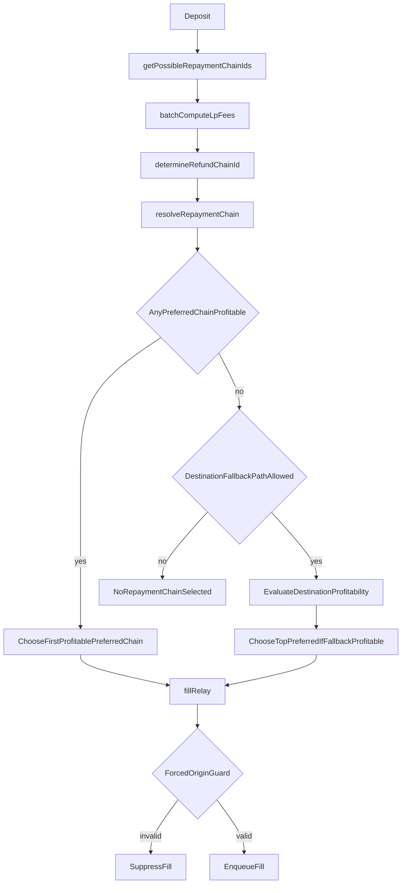

# Repayment Selection

## When to read this

Read this when you need to understand how relayer chooses the final `repaymentChainId` after eligibility is known and LP fees/profitability are evaluated.

Related docs:

- `docs/repayment-eligibility.md` (InventoryClient eligibility stage)
- `docs/relayer-fill-decision-flow.md`
- `src/relayer/README.md`

Primary code:

- `src/relayer/Relayer.ts`
- `src/clients/InventoryClient.ts` (only as input dependency)

## Scope of this doc

This doc covers the Relayer-owned stage:

- `batchComputeLpFees()`
- `resolveRepaymentChain()`
- `fillRelay()` final guard

It intentionally does not re-explain detailed eligibility heuristics from InventoryClient. See `docs/repayment-eligibility.md` for that.

## Selection pipeline

## Step 1: LP fee precompute

`batchComputeLpFees()` expands each deposit across `paymentChainId` candidates from `getPossibleRepaymentChainIds()` and calls `hubPoolClient.batchComputeRealizedLpFeePct(...)`.

LP fee results are keyed by:

- `originChainId`
- `inputToken`
- `inputAmount`
- `quoteTimestamp`

with one key mapping to multiple `paymentChainId` fee candidates.

## Step 2: Ordered eligibility input

`resolveRepaymentChain()` asks `inventoryClient.determineRefundChainId(deposit)` for ordered eligible chains.

If none are returned, relayer treats deposit as not currently selectable (with unprofitable-like handling downstream).

For the full eligibility internals, see `docs/repayment-eligibility.md`.

## Step 3: Profitability pass

For each preferred chain:

1. retrieve matching LP fee candidate
2. call `profitClient.isFillProfitable(...)`
3. build profitability struct (gas, relayer fee, total fee, etc.)

If one or more preferred chains are profitable, choose the first profitable preferred chain.

## Destination fallback path

If no preferred chain is profitable, relayer may evaluate destination-chain fallback profitability when:

- destination not already in preferred chain list
- `canTakeDestinationChainRepayment(deposit)` is true
- `shouldForceOriginRepayment(deposit)` is false

If fallback is profitable, relayer still sets repayment to top preferred chain and logs delta relative to destination-chain profitability assumptions.

Interpretation note: this branch intentionally privileges inventory policy from `determineRefundChainId()` while using destination profitability as a depositor-friendly sanity check, not as the final policy override.

## Final submit-time guardrail

`fillRelay()` enforces forced-origin safety:

- if deposit forces origin repayment and selected `repaymentChainId` is not origin, fill is suppressed.

This protects against accidental policy violations even if upstream selection logic changes.

## Failure outcomes

- no preferred chains: no eligible path from inventory stage
- preferred chains but no profitability: economics fail at current LP fee/gas conditions
- fallback profitable but top preferred chosen: intentional inventory-priority behavior

## Change hazards

- eligibility/precompute contract drift: if `getPossibleRepaymentChainIds()` and eligibility logic diverge, LP-fee data can be missing for candidate chains.
- ordering sensitivity: changing preferred-chain ordering in InventoryClient can change selected repayment chain even when profitability code is unchanged.
- force-origin invariant: removing or weakening `fillRelay()` guardrails can permit invalid repayment-chain submissions.

## Contributor recommendations

- Keep selection-stage changes isolated from eligibility-stage logic and docs.
- When modifying fallback behavior, validate interaction with depositor quote assumptions and logs.
- Preserve `fillRelay()` forced-origin guard as invariant defense.
- Add tests that cover both profitable preferred selection and fallback edge conditions.
