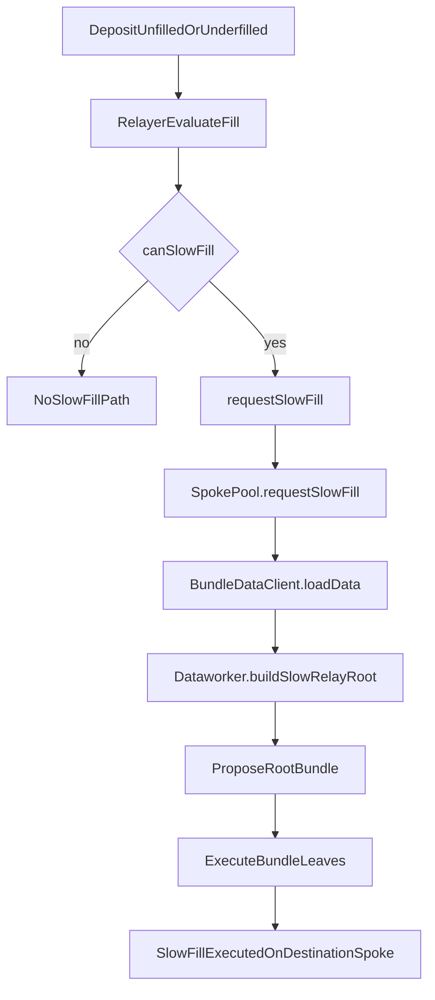

# Slow Fill Lifecycle

## When to read this

Read this when you are changing relayer behavior for underfilled deposits, or when you need to trace how a slow-fill request turns into bundle accounting and eventual execution.

Related overviews:

- `src/relayer/README.md`
- `src/dataworker/README.md`

Primary files:

- `src/relayer/Relayer.ts`
- `src/dataworker/Dataworker.ts`
- `docs/bundle-construction.md`
- `sdk-v2/src/clients/BundleDataClient/BundleDataClient.ts`

## Lifecycle summary

## Relayer side: when slow-fill is considered

`Relayer.canSlowFill(deposit)` requires:

- input/output tokens equivalent under HubPool mapping
- not from lite chain
- not to lite chain

`evaluateFill()` may call `requestSlowFill()` when:

- depositor is on configured slow depositor list, or
- fill is profitable but local balance is insufficient, or
- fill is unprofitable and slow relays are enabled

## Relayer side: when slow-fill request is suppressed

`requestSlowFill()` suppresses request if:

- protocol forces origin repayment (`depositForcesOriginChainRepayment`) or destination is lite
- original deposit message is non-empty
- deposit age is below `RELAYER_SLOW_FILL_MIN_AGE`
- a slow-fill request already exists on destination spoke

If not suppressed, relayer enqueues:

- EVM path: `requestSlowFill(convertRelayDataParamsToBytes32(deposit))`
- SVM path: `svmFillerClient.enqueueSlowFill(...)`

Then it marks local fill status as `RequestedSlowFill`.

## Dataworker side: how requests become bundle content

Dataworker uses `BundleDataClient.loadData(blockRanges, spokePoolClients)` and then:

- `buildSlowRelayRoot(...)` -> `_buildSlowRelayRoot(bundleSlowFillsV3)`

Slow fills are represented as dedicated slow-fill leaves and included in root bundles.

The bundle system then accounts for them in running balances and execution.

## Bundle accounting relationship

Per `docs/bundle-construction.md`:

- slow fills are part of capital obligations on destination spokes
- unfilled/partially filled deposits can generate slow-fill leaves
- slow-fill amounts reduce running balances
- slow-fill excesses are also tracked to avoid over-reserving capital

So slow fills are not an isolated mechanism; they directly affect cross-chain pool rebalance instructions and relayer refund economics.

## Execution phase

After challenge period:

- root bundle execution processes slow-fill leaves on destination spokes
- recipients are eventually paid from protocol-managed settlement flow

This is the liveness guarantee path when fast relayer fills do not complete the deposit.

## Cross-module invariants

- relayer should only request slow fills for deposits compatible with protocol expectations
- dataworker should deterministically derive slow-fill leaves from canonical event/block-range data
- running-balance math must consistently include slow-fill obligations and excess adjustments

## Common failure/confusion points

- treating slow fill as equivalent to immediate recipient payment (it is deferred through bundles)
- assuming any unprofitable fill should auto-slow-fill (gated by `canSlowFill` and feature flags)
- forgetting message-based suppression (`deposit.message` must be empty)
- missing that lite-chain constraints block slow-fill requests

## Contributor recommendations

- Keep `canSlowFill()` and `requestSlowFill()` checks conservative and explicit.
- When changing slow-fill eligibility, verify downstream bundle accounting still matches.
- Add integration tests that span relayer request -> bundle construction -> execution semantics.
- Keep logs specific about why a slow-fill request is suppressed versus deferred.

