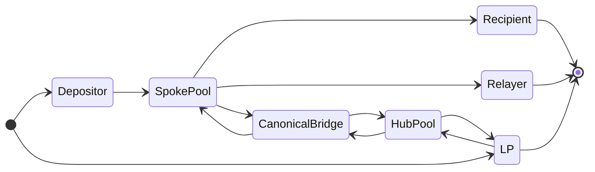
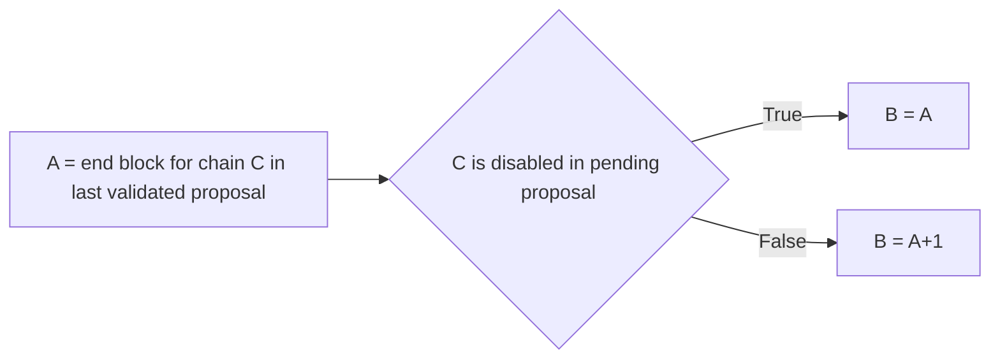
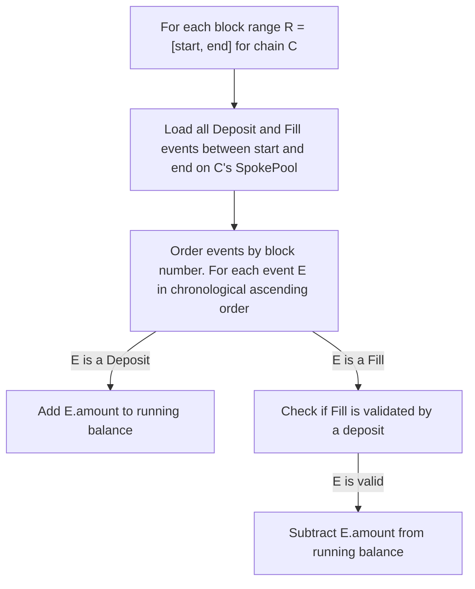
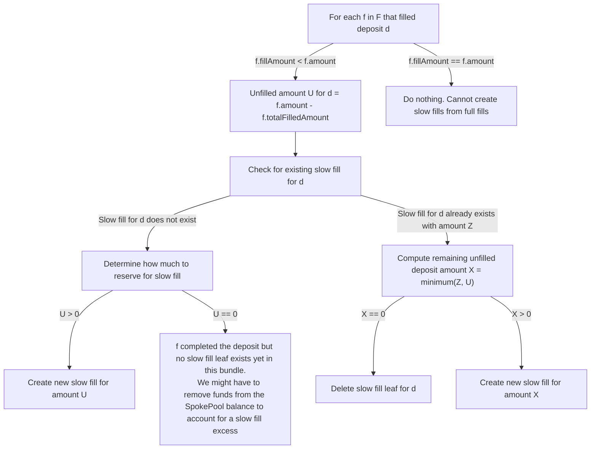

# How Across Root Bundles are Constructed

This document explains how the Dataworker constructs "root bundles", which instruct the Across system on how to reallocate LP capital to keep the system functioning and providing an effective bridging service.

The following README is a simplified summary of the exact protocol rules described in [UMIP-179](https://github.com/UMAprotocol/UMIPs/blob/2046d3cc228cacfb27688fc02e9674aef13445c9/UMIPs/umip-179.md) and its predecessor [UMIP-157](https://github.com/UMAprotocol/UMIPs/blob/92abcfcb676b0c24690811751521cd0782af5372/UMIPs/umip-157). These UMIP's describe the explicit rules that the Dataworker implements. In other words, the "Dataworker" code is an implementation of the UMIP-179 "interface".

## Why does Across need to move capital around?

There are two types of capital pools in Across: liquidity provider capital in the `HubPool` ("LP capital") and capital held in the `SpokePools` ("SpokePool balance").

SpokePool capital is required for two purposes: refunding relayers who successfully filled a deposit, on the repayment chain of their choice, and fulfilling deposits "slowly". These "slow" fills are performed when a deposit has not been fully filled by relayers and provide an assurance to depositors that their deposits will be filled **eventually** after some capped amount of time.

However, oftentimes SpokePools do not have enough capital on hand to fulfill the capital requirements described in the previous paragraph. This is when Across would want to tap into LP capital on HubPool to fulfill these capital deficits. Usually, the L2 network on which the SpokePool in question is deployed has a canonical bridge connected to Ethereum, where the HubPool is deployed. Across can therefore send its LP capital from the HubPool to the SpokePool and usually, this is a pretty fast L1 to L2 bridge over the canonical bridge.

Tokens only enter Across in two ways: via user deposits or via liquidity providers. Tokens exit via SpokePools as refunds for relayers or to deposit recipients, and HubPools when liquidity providers remove funds.



### What is a canonical bridge?

An L2's "canonical bridge" is one that is secured by the same trusted agents that secure the consensus of the network. For example, Optimism, Arbitrum and Polygon have canonical burn-and-mint bridges, while Avalanche bridge is secured by a [wardens-based system](https://li.fi/knowledge-hub/avalanche-bridge-a-deep-dive/) that is separate from the [Avalanche validators](https://docs.avax.network/learn/avalanche/avalanche-consensus). Ultimately, it is required to read the code of an L2's bridge to determine whether it introduces additional trust assumptions.

### Supporting capital deficits on SpokePools without canonical bridges

When an L2's SpokePool doesn't have a canonical bridge connected to Ethereum, Across has a few ways to overcome this.

One, it could use a third party bridge, but this is strongly avoided because it exposes LP capital to additional trust assumptions. Across historically has avoided supporting networks without canonical bridges for this reason, and moreover it's been unnecessary as the most popular L2 networks have proven to be those that have spent the time to build out an effective canonical bridge.

Secondly, it could try to incentivize depositors to send capital to the SpokePool that Across can use to refund relayers and execute slow fills. Depositors obviously are incentivized by profit so they must have a reason to deposit on a SpokePool.

## So, how does Across move capital around?

This is where "bundles" come in. Across "bundles" are really just a collection of Merkle trees (summarized as Merkle roots) containing instructions about what to do with LP capital and SpokePool balance:

1. Which relayers to refund out of each SpokePool balance (and how much to refund)
2. Which deposits to slow fulfill out of each SpokePool balance
3. Whether to send any LP capital out of the HubPool over the canonical bridge to a SpokePool
4. Whether to return any SpokePool balance back to the HubPool

Points 3 and 4 above are dependent on 1 and 2 because the amount of capital to move between HubPool and SpokePool depends primarily on the relayer refund and slow fill requirements across the SpokePools.

Across therefore keeps track of a "running balance" (for each token and for each chain) that takes into account:

- The amount of token deposited on the SpokePool
- minus the amount of refunds owed to relayer who wanted repayment out of that SpokePool
- minus the unfilled amount from deposits needed to be slow filled out of that SpokePool

Generally, if this running balance is negative, then Across needs to send LP capital out of the HubPool to the SpokePool to meet all debt requirements.

### SpokePool targets and thresholds

If the running balance is positive, then Across has a choice: keep the excess balance on the SpokePool in order to fulfill any future deficits or send some of the excess back to the HubPool so that it can subsequently be used to cover future deficits on other SpokePools. This "choice" can be configured on a chain by chain and token by token basis by the Across Financial Council by setting certain configurations in the `ConfigStore`. The "AFC" will do this by setting "target" and "threshold" running balances per token per chain that tell Across to send excess SpokePool balance over the target back to the HubPool, whenever the SpokePool balance exceeds the threshold.

## How often does Across move capital around?

In a fantastical world, Across moves capital around instantaneously whenever capital deficits and excesses appear. This is obviously unrealistic however because bundles are constructed and proposed optimistically. This means that an actor, called a "Dataworker", will propose instructions for moving LP capital around that are subject to an optimistic challenge period. This challenge period is currently set to two hours. This value is configured such that all actors with stake in Across, including relayers who need to be refunded, LP's who have deposited funds passively to earn yield in the HubPool, and depositors who are expecting to be filled on their destination chain, can verify that the instructions proposed are valid.

These instructions can very easily be modified to conduct an "attack" on Across: "send all LP capital to my EOA on the Ethereum_SpokePool". Therefore it's important that these bundle proposals are subject to a long enough challenge period that every invalid bundle gets challenged.

On the other hand, the longer the challenge period, the slower that Across can respond to capital requirements. Across essentially can only move capital around as often as the challenge period, so every two hours currently.

Every two hours, the Dataworker will propose capital reallocation instructions to Across based on the previous two hours' worth of token flows. This is where the concept of "bundle block ranges" comes into play. Each proposed root bundle includes something called the ["bundle evaluation block numbers"](https://github.com/across-protocol/contracts/blob/master/contracts/HubPool.sol#L149). These are included by the Dataworker [at proposal time](https://github.com/across-protocol/contracts/blob/master/contracts/HubPool.sol#L567) and are used by everyone else to validate their proposed Merkle roots.

These end blocks inform all actors which block ranges, per chain, they included Bridge deposit and fill information for to construct their Merkle roots containing instructions for how Across should move capital around.

### How do end blocks imply a block range?

You might have noticed that the `uint256[] calldata bundleEvaluationBlockNumbers` are a single array of block numbers; how can you know which block range to query events over? A range usually implies an array of two dimensional arrays, likely with a "start" and "end" block per chain.

The implied block range for a chain is simply:

- `start`: previous bundle's end block for this chain + 1
- `end`: the bundle end block for the chain

### `bundleEvaluationBlockNumbers` is an array of numbers, how do you know which chain each block references?

This is why Across must define a canonical "chain ID index" as shown [here](https://github.com/across-protocol/relayer/blob/master/src/common/Constants.ts#L9) which contains an append-only list of chain ID's. This index list is used by an example Dataworker implementation and matches identically the same canonical list defined in the [Across UMIP](https://github.com/UMAprotocol/UMIPs/blob/master/UMIPs/umip-157.md#global-constants).

When evaluating a `bundleEvaluationBlockNumbers`, the index of the block number must be matched with the index in the "chain ID index" list to figure out which chain the block number refers to. For example, if the `bundleEvaluationBlockNumbers=[1,2,3,4,5]` and the chain ID index list is `[1,10,137,288,42161]`, then the end block of `2` must be used as the end block in a block range for chain ID `10` (i.e. Optimism).

One assumption in Across, is that each chain that Across supports must have an entry in the canonical chain ID index list and that the length of the `bundleEvaluationBlockNumbers` array must equal the length of the chain ID index list.

## Determining bundle start blocks when evaluating a pending root bundle proposal

`B` is trivially known since it is emitted in the [`ProposedRootBundle`](https://github.com/across-protocol/contracts/blob/master/contracts/HubPool.sol#L152) event during the creation of each new pending bundle proposal. We therefore need to find `A`, the bundle start block `<= B` to evaluate the root bundle.



The bundle block range for each chain is therefore `[A, B]`, where disabled chains have zero length ranges (i.e. A = B).

## Finding bridge events in block ranges

Now that we have `R = [A, B]`, we need to agree on all deposits and fills that occurred in the block range. We'll use these events to construct the resultant running balance for the bundle.



### Validating fills

A fill must match a deposit on every shared parameter that they have in common. The matched deposit does not have to be in the same bundle as the fill. A fill contains the following [event parameter](https://github.com/across-protocol/contracts/blob/a663586e8619bc74cb1da2375107bd5eef0f3144/contracts/interfaces/V3SpokePoolInterface.sol#L124)'s:

```solidity
event FilledRelay(
    bytes32 inputToken,
    bytes32 outputToken,
    uint256 inputAmount,
    uint256 outputAmount,
    uint256 repaymentChainId,
    uint256 indexed originChainId,
    uint256 indexed depositId,
    uint32 fillDeadline,
    uint32 exclusivityDeadline,
    bytess32 exclusiveRelayer,
    bytes32 indexed relayer,
    bytes32 depositor,
    bytes32 recipient,
    bytes message,
    RelayExecutionEventInfo relayExecutionInfo
);
```

A [deposit](https://github.com/across-protocol/contracts/blob/a663586e8619bc74cb1da2375107bd5eef0f3144/contracts/interfaces/V3SpokePoolInterface.sol#L99) contains:

```solidity
event FundsDeposited(
    bytes32 inputToken,
    bytes32 outputToken,
    uint256 inputAmount,
    uint256 outputAmount,
    uint256 indexed destinationChainId,
    uint256 indexed depositId,
    uint32 quoteTimestamp,
    uint32 fillDeadline,
    uint32 exclusivityDeadline,
    bytes32 indexed depositor,
    bytes32 recipient,
    bytes32 exclusiveRelayer,
    bytes message
);
```

All of the shared event properties must match. In addition, the fill's matched deposit must have been emitted from the SpokePool at the `originChainId` of the fill. The fill must have been emitted from the SpokePool on the `destinationChainId`.

The only exception to the above rule is if `outputToken` is equal to the zero address, then the "equivalent" token address should be substituted in as described in [UMIP-179](https://github.com/UMAprotocol/UMIPs/blob/2046d3cc228cacfb27688fc02e9674aef13445c9/UMIPs/umip-179.md#finding-valid-relays).

## Incorporating slow fills

At this point we have `D`, the set of all deposits in the block range, and `F`, the set of all fills that were validated in the block range. Each `F` has a `relayer` that needs to be refunded, so we need to mark down a refund (equal to the filled amount plus the relayer fee percentage) for each `F`.

For each `F` that did not "fully fill" a deposit; in other words, for each `F` where `fillAmount < amount` we need to see if the deposit has any "unfilled" amount remaining. This is where we would produce a "slow fill" leaf. The heuristic for determining these slow fills is roughly:



Each slow fill amount `U` should be subtracted from the running balance of the slow fill's destination chain.

### Slow Fill Excesses

You'll notice that one of the flow chart paths leads to a possible slow fill "excess". This is referring to the situation where a slow fill leaf sent in a previous bundle to cover an unfilled deposit amount was front-run by a relayer's partial fill. This means that the SpokePool balance has some excess amount now containing the amount that the previous bundle had reserved as a slow fill payment. This excess would then need to be deleted from the running balance.

Excesses from slow fills are only created when a partial fill completes a deposit. To compute the excess, we need to always check that a previous bundle proposer had not already sent a slow fill amount for this unfilled deposit. This can be determined by checking the last partial fill for the deposit. If the partial fill occurred in a previous bundle, then a slow fill was sent for it and there is an excess if `f` was not the slow fill execution. If `f` was a slow fill execution, then there is an excess if the executed amount is less than the original slow fill payment

## Completing the `PoolRebalanceLeaf`

At this point we have a running balance for the token for each chain. We also know all of the refund and slow fill payments that we need to instruct each SpokePool to reserve payments for. We can finally figure out how many LP funds to send out of the HubPool to each SpokePool.

This is where we'll incorporate the section on [SpokePool targets and thresholds](#spokepool-targets-and-thresholds) to determine how much of the running balances to move over to the `netSendAmount` value in a [PoolRebalanceLeaf](https://github.com/across-protocol/contracts/blob/master/contracts/interfaces/HubPoolInterface.sol#L22). Inside the HubPool's code, only the positive `netSendAmounts` are [sent out of the HubPool](https://github.com/across-protocol/contracts/blob/master/contracts/HubPool.sol#L893) to the SpokePools via the canonical bridges. Conversely, the `runningBalances` are simply accounting values to keep track of the running count of SpokePool balances. Whenever a portion of the `runningBalances` are included in the `netSendAmounts`, the running balances should be decremented accordingly to account for the tokens being sent out of the Hub or SpokePool.

## Completing the `RelayerRefundLeaf`

If a `runningBalance` is below its target for a particular chain, the Dataworker might include a positive `netSendAmount` for that chain to instruct the HubPool to send tokens to the SpokePool.

However, if a `runningBalance` is above its target, the Dataworker might want to send tokens from the SpokePool to the Hub. This is achieved by setting a negative `netSendAmount`. At the HubPool level, negative `netSendAmounts` do nothing. However, the `RelayerRefundLeaf` has a property called [`amountToReturn`](https://github.com/across-protocol/contracts/blob/master/contracts/interfaces/SpokePoolInterface.sol#L12) which is supposed to be set equal the negative of any negative `netSendAmounts`. Any positive `amountToReturn` values result in [tokens being sent from the SpokePool](https://github.com/across-protocol/contracts/blob/master/contracts/SpokePool.sol#L923) back to the Hub via the canonical bridge.

## Conclusion

At this point we have a simplified description for deterministically setting all of the following values for a new root bundle proposal

- For each chain with a SpokePool:
  - Bundle block range including an implied start block and a published end block on-chain
  - For each token:
    - Running balance
      - Deposits with origin chain equal to this chain
      - Minus fills to refund where repayment chain equal to this chain
      - Minus slow fills where destination chain equal to this chain
      - Minus slow fill excesses
      - Minus amounts included in `netSendAmounts`
      - Plus latest validated running balance for token
    - Net send amounts
    - Refunds for fills where repayment chain equal to this chain
      - Amount per relayer
    - Slow fills where destination chain equal to this chain

This is everything that the Dataworker needs to construct a root bundle! All that's left to do is to create Merkle Leaves containing the above information in the formats described below, and to summarize them as merkle roots. Only the merkle roots and bundle end blocks are published on-chain. Any validator of the bundle should now be able to take the bundle end blocks and re-construct the full merkle trees using the instructions above. If the validator constructs different merkle roots, then they should dispute the bundle during the challenge period.

## Appendix

Root bundle merkle leaf formats

- [PoolRebalanceLeaf](https://github.com/across-protocol/contracts/blob/95c4f923932d597d3e63449718bba5c674b084eb/contracts/interfaces/HubPoolInterface.sol#L11): One per chain
- [RelayerRefundLeaf](https://github.com/across-protocol/contracts/blob/95c4f923932d597d3e63449718bba5c674b084eb/contracts/interfaces/SpokePoolInterface.sol#L9) One per token per chain
- [SlowFillLeaf](https://github.com/across-protocol/contracts/blob/95c4f923932d597d3e63449718bba5c674b084eb/contracts/interfaces/V3SpokePoolInterface.sol#L66) One per unfilled deposit
- [RootBundle](https://github.com/across-protocol/contracts/blob/95c4f923932d597d3e63449718bba5c674b084eb/contracts/interfaces/HubPoolInterface.sol#L53) how the Dataworker's proposal is stored in the HubPool throughout its pending challenge window
